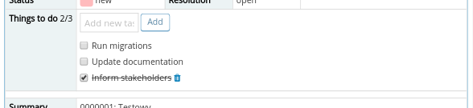
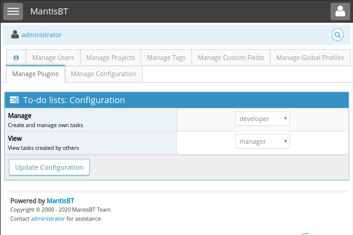

# To-Do Lists

To-Do Lists Plugin for [Mantis Bug Tracker](https://www.mantisbt.org/). 
Allows users (e.g. developers) to manage to-do tasks within a bug report.

| MantisBT | Plugin                                                                         |
|----------|--------------------------------------------------------------------------------|
| v2.x     | [v2](https://github.com/andrzejkupczyk/mantisbt-todolists/releases/latest)     |
| v1.3.x   | [v1](https://github.com/andrzejkupczyk/mantisbt-todolists/releases/tag/v1.2.2) |

## Install

### Manually

- Download or clone the repository and place it under the MantisBT plugins folder.
- Rename the folder to ToDoLists
- Go to Manage - Manage Plugins and install the plugin

### Using Composer

If you are using [composer/installers](https://github.com/composer/installers) to simplify plugin management, run:  
`composer require andrzejkupczyk/mantis-todolists`

## Screenshots

### Issue details

### Configuration

## Translations

Currently supported languages are:
:de:
:es:
:gb:
:poland:
:ru:
